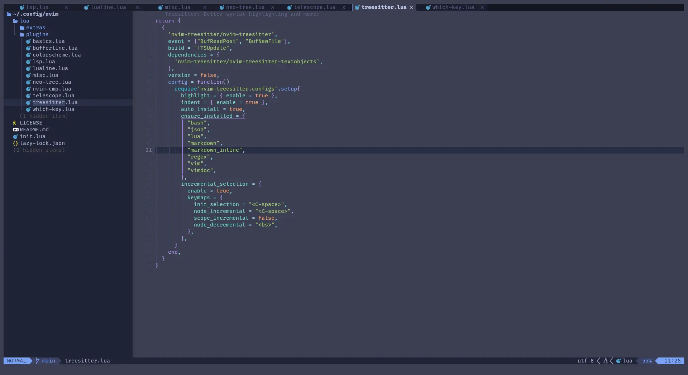
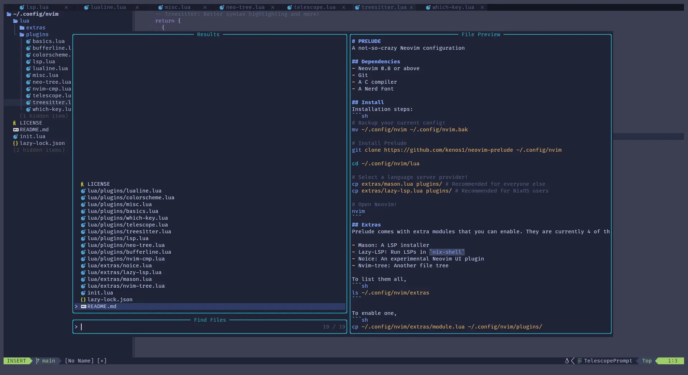
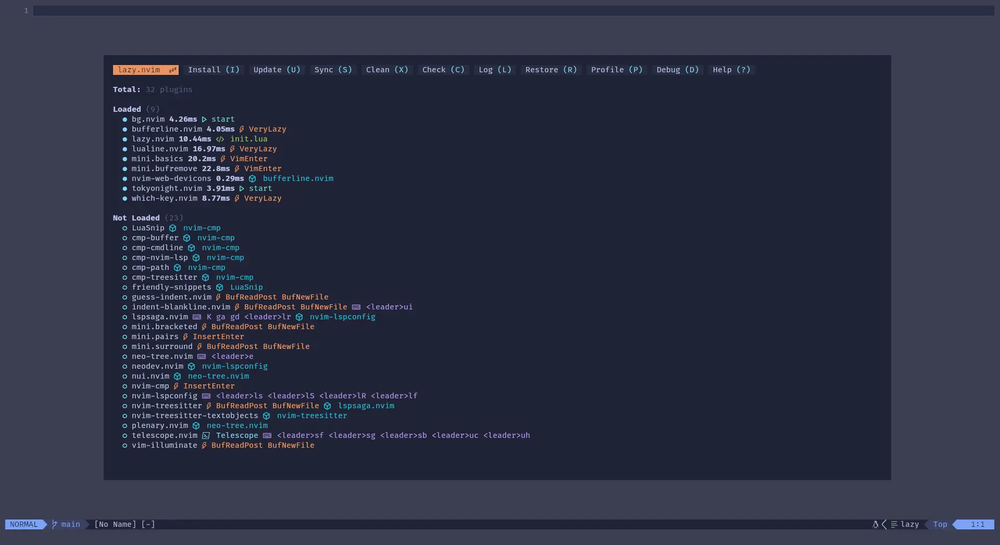

# PRELUDE
A not-so-crazy Neovim configuration





## Dependencies
- Neovim 0.8 or above
- Git
- A C compiler
- A Nerd Font

## Install
Installation steps:
```sh
# Backup your current config!
mv ~/.config/nvim ~/.config/nvim.bak

# Install Prelude
git clone https://github.com/kenos1/neovim-prelude ~/.config/nvim

cd ~/.config/nvim/lua

# Select a language server provider!
cp extras/mason.lua plugins/ # Recommended for everyone else
cp extras/lazy-lsp.lua plugins/ # Recommended for NixOS users

# Open Neovim!
nvim
```
## Extras
Prelude comes with extra modules that you can enable. They are currently 4 of them, with more to come.

- Mason: A LSP installer
- Lazy-LSP: Run LSPs in `nix-shell`
- Noice: An experimental Neovim UI plugin
- Nvim-tree: Another file tree
- Better-escape: Enter normal mode with `jj` and `jk`
- Overseer: Run tasks and manage them
- Toggleterm: Better terminal management

To list them all,
```sh
ls ~/.config/nvim/extras
```

To enable one,
```sh
cp ~/.config/nvim/extras/module.lua ~/.config/nvim/plugins/
```

## Design Principles

- The basics of most Neovim configurations (settings and plugins everyone can agree on)
- No hidden surprises (we try to change Neovim as little as possible while providing a beautiful and swift experience)
- Fully hackable (you can see everything in the config)
- Opt-out lazy-loading (to get you into having an optimized config)
- Extra modules that are opt-in (enable special plugins or configs)
- Nothing too crazy (did you read the description?)

## Motivations
This Neovim "distro" was created due to the issues and annoyances that a couple of users faced when using other Neovim distrobutions like NvChad, LazyVim, etc. (No hard feelings)

## Contributions
We welcome any contributions!
